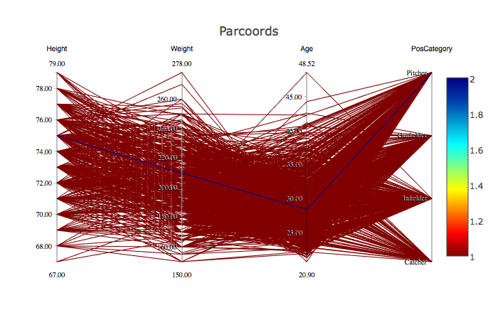
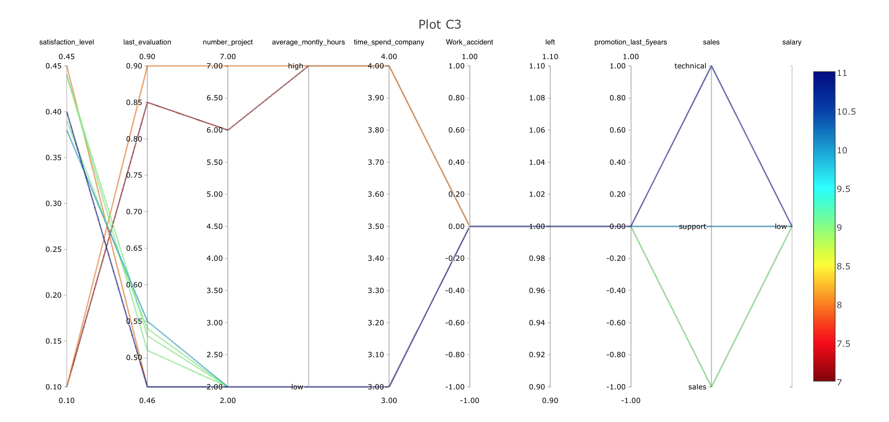
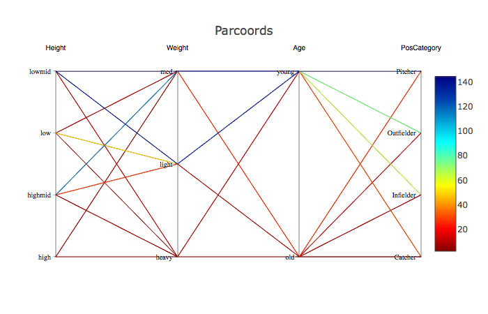

# freqparcoord.cd

### Table of Contents
1. [Overview](#overview)
2. [Quickstart](#quickstart)
3. [Key Functions](#key-functions)
4. [Warnings](#warnings)
5. [Further Examples](#further-examples)
6. [Authors](#authors)

### Overview

The **freqparcoord.cd** package was created to serve as a parallel
coordinates graphing package with special focus on the black screen
problem, dealing with categorical variables, and the NA problem. 

It builds upon the [`freqparcoord` package](https://cran.r-project.org/web/packages/freqparcoord/index.html).

* The black screen problem occurs when there are too many data points to
plot. This results in a complete black screen from which no useful
information may be gleaned. 


This is solved in [`freqparcoord`](https://cran.r-project.org/web/packages/freqparcoord/index.html)
by displaying on the most frequent relations.  However, this is not
suitable for categorical variables (though one can make them grouping
variables). We account for this here by showing the most significant 
tuples.

* In addition, R and R packages typically leave out any rows with NA
values. Unfortunately for data sets with high NA counts, this may have
drastic effects, such as low counts and possible bias. 
[`freqparcoord.cd`](https://github.com/matloff/freqparcoord.cd) addresses this
issue by allowing these rows to contribute to overall counts, but to
lesser extents.

### Quickstart

###### Normal Example
```R
# Load data
file <- system.file("data", "hrdata.csv", package="freqparcoord.cd")
hrdata = read.table(file, header=TRUE, sep=",", na.strings="")

# Create an interactive plot with the 10,000 most frequent tuples
discparcoord(hrdata, interactive=TRUE, k=10000, name="Nondiscrete HR Data")
```


###### Categorical Example
```R
# Load data
file <- system.file("data", "hrdata.csv", package="freqparcoord.cd")
hrdata = read.table(file, header=TRUE, sep=",", na.strings="")

input1 = list("name" = "average_montly_hours", "partitions" = 3, "labels" = c("low", "med", "high"))
input = list(input1)
# This will discretize the data by partitioning average monthly hours into 3parts
# called low, med, and high
hrdata = discretize(hrdata, input)

# account for NA values and plot with parallel coordinates
discparcoord(hrdata)                                  # plot c1
```
C1: 

```R
# same as above, but with scrambled columns
# By default, interactive plotting allows you to drag around columns
# to scramble them
discparcoord(hrdata, permute=TRUE)                    # plot c2
```
C2: 

```R
# same as above, but show top k values, title,  and interactive plot
discparcoord(hrdata, k=8, interactive=TRUE, name="Plot C3")           # plot c3
```
C3: 

```R
# same as above, but group according to profession
# This will create 11 different plots, 1 for each profession
discparcoord(hrdata, grpcategory="sales", interactive=TRUE) 
```

### Key Functions

#### `discparcoord()`
The main function is `discparcoord()`, which may optionally be used with `discretize()`.
`discparcoord()` accounts for partial values and drawing.

#### `discretize()`
`discparcoord()` may optionally be used with `discretize()`.

`discretize` takes a dataset and a list of lists. It discretizes the dataset's values such that `plot()` may chart 
categorical variables.
The inner list should contain the following variables: `int partitions`, `string vector labels`, `vector lower bounds`, 
`vector upper bounds`. The last three are optional.



#### `discparcoord()` details
Encompassed in discparcoord, we provide 4 key functions -- `partialNA()` `grpcategory()`, `draw()`,
and `interactivedraw()`.

1. The call `partialNA(dataset,n)` inputs a dataset and
returns a new dataset consisting of the **n** most frequent patterns
with an added column -
the frequency of each column.  This dataset contains no NA values, as
all of the columns previously with NA values have now been eliminated. 

By default, `partialNA` returns the 5 most significant tuples.

2. The `grpcategory` option allows you to create multiple plots, one for each category. If
a field has 4 possible values, then `discparcoord()` with the `grpcategory` option will 
create a plot for each category, where each plot has the specific category's attributes.

For example, if a field "Weight "has "Heavyweight" and "Lightweight", then this will create
one plot where all tuples are heavyweights, then one more where where all tuples are lightweights.

3. `draw` takes a dataset and draws a parallel coordinates plot in the same directory. It
also takes a name for the name of the plot, and a choice for whether or not to have labels. When there are 
many data points, the labels are unreadable and for these times it is better to leave labels off. The default is 
to have labels on. 

An example of discretized mlb data drawn with `draw`.


4. `interactivedraw` does the same as draw, but draws an interactive plot. We recommend using this option.

### Warnings
1. By default, `partialNA()` returns the five most frequent correlations. If there is low/no correlation between 
variables, then this may be misleading.
2. Due to the limited size of screens compared to the number of variables in many data sets, we recommend subsetting 
input data to only include
relevant variables prior to using the package.
3. Sometimes labels greatly hinder the visibility and clarity of the plot. This can be circumvented by opting to remove 
labels in plot.
4. Categorical data is currently scaled by 1, starting from 1. When placed on the same axis as numerical data with high 
values (ex: 100+), it can
be difficult to differentiate between categories when used with `draw()`. This does not
occur with `interactivedraw()`.

### Further Examples
1. A small example of parallel coordinates plotting
```R
library(freqparcoord.cd)
smallexample()
```


2. Using categorical variables with the mlb data set with `discretize`
and interactive plotting, with the most significant 1000 tuples.

```R
library(freqparcoord.cd)
# load freqparcoord to get the mlb data set
library(freqparcoord)
data(mlb)
# Get the Height, Weight, Age, and Position of Players
m <- mlb[,4:7]

inp1 <- list("name" = "Height",
             "partitions"=4,
             "labels"=c("low", "lowmid", "highmid", "high"))

inp2 <- list("name" = "Weight",
             "partitions"=3,
             "labels"=c("light", "med", "heavy"))

inp3 <- list("name" = "Age",
             "partitions"=2,
             "labels"=c("young", "old"))

# Create one list to pass everything to discretize()
discreteinput <- list(inp1, inp2, inp3)

# At this point, all of the data has been discretized
discretizedmlb <- discretize(m, discreteinput)

# Account for NA values and weigh values; interactively plot; take top 1000 tuples
discparcoord(discretizedmlb, interactive=TRUE, name="MLB", k=1000)
```


### Authors
Norm Matloff, Harrison Nguyen, Vincent Yang
